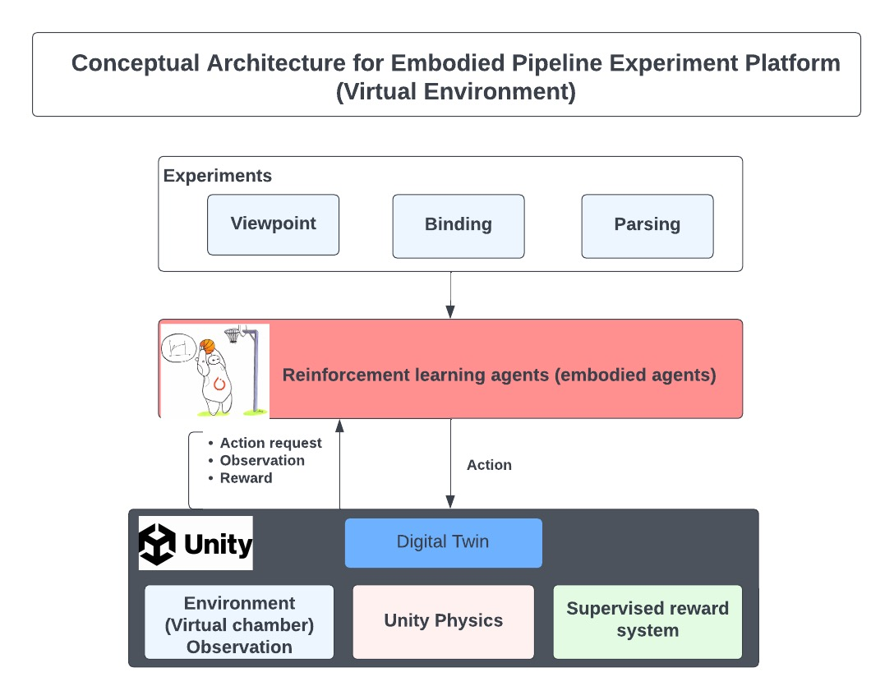

# **Unity environment for ChickAI: virtual controlled-rearing experiments**

This is a collection of tools for simulating virtual agents under controlled-rearing conditions. The agents
generated and studied through this pipeline can be compared directly to real chicks recorded by the **[**Building a Mind
Lab**](http://buildingamind.com/)**. This pipeline provides all necessary components for simulating and replicating embodied models from the lab.

The figure below shows the experiment setup for the three experiments discussed in the guide.



## **How to Use this Repository**

This directory provides three components for building embodied virtual agents. These are a video game which serves as a virtual world, a set of programs to run experiments in the virtual world, and a set of programs to visualize the data coming from the experiments. Once users download this repo they will most likely need to open Unity at least once to generate an executable of the environment. After an executable is available, the user should be able to run the necessary simulations. This will result in data that can be analyzed using the scripts in the analysis folder.

If users are unfamiliar with how to install a git repository or have never used unity before please scroll down to how to the how to install section.

## **Directory Structure**

**Following the directory structure of the code.**

```

├── data
│   ├── executables
├── docs
├── mkdocs.yml
├── README.md
├── requirements.txt
├── scripts
│   ├── parsing_sup.sh
│   ├── parsing_unsup.sh
│   └── viewpoint_sup.sh
├── src
│   ├── analysis
│   └── simulation
└── tests

```

* `src/analysis`**: **Contains the code for visualizing and analyzing results from the simulation experiments.
* `data`: This folder contains executables, experimental results, and analysis results. A user will rarely interact with this folder directly. Most scripts assume this directory and all its contents exist.
* `src/simulation`: Contains the code for running experiments with simulated agents. Following is the structure of simulation folder:
  
  ```
  ├── agent
  ├── algorithms
  ├── callback
  ├── common
  ├── conf
  ├── env_wrapper
  ├── networks
  ├── __pycache__
  ├── run_parsing_exp.py
  ├── run_parsing_icm.py
  ├── run_viewpoint_exp.py
  └── utils.py
  
  ```
* `Unity`: Contains a Unity project which is a virtual replication of the VR Chambers used in contolled-rearing studies from the lab. This folder should be opened as a Unity project in the Unity Editor.
* `tests`: Contains unit tests to test the environment and others
* `docs`: Contains project documentation 
* `scripts`: Contains bash scripts to run the respective experiment

## **How to Install**

In this section, you will pull this repository from Github, open the Unity environment, and build the ChickAI environment as an executable.

### **Codebase Installation**

1. Install Git and/or Github Desktop. If you install Git, you'll be able to interact with Github through the command line. You can download Git using the directions here: **[https://git-scm.com/downloads](https://git-scm.com/downloads)**. If you install Git Desktop, you can use a GUI to interact with Github. You can install Github Desktop by following the directions here: **[https://docs.github.com/en/desktop/installing-and-configuring-github-desktop/](https://docs.github.com/en/desktop/installing-and-configuring-github-desktop/)**. For the following steps, I will provide the command line arguments (but you can use the GUI to find the same options in Github Desktop).
2. To download the repository, click the Code button on the pipeline_embodied repo. Copy the provided web URL. Then follow the code below to change to directory where you want the repo (denoted here as MY_FOLDER) and then clone the repo.
   ```
   cd MY_FOLDER
   git clone URL_YOU_COPIED_GOES_HERE
   ```
3. Checkout the branch you want to be extra sure that you're using the right branch. 
   ```
   cd pipeline_embodied
   git checkout DESIRED_BRANCH
   ```
4. **(Highly Recommended) **[create and configure a virtual environment](https://uoa-eresearch.github.io/eresearch-cookbook/recipe/2014/11/20/conda/ "Link for how to set-up a virtual env")
   ****steps described below :****
   ```
   conda create -n pipeline_embodied_env python=3.8
   conda activate pipeline_embodied_env
   git clone git@github.com:buildingamind/pipeline_embodied.git
   cd pipeline_embodied
   pip install -r requirements.txt
   
   ```

### **Running an Experiment (default configuration)**

After having followed steps 1-5 above once experiments can be run with a few lines of code

```
  bash scripts/<EXPERIMENT_NAME>_sup.sh
```

where `EXPERIMENT_NAME` is one of the experiments (`viewpoint`, `binding`, `parsing`) using supervised reward.**

### **Running Standard Analysis**

After running the experiments, the pipeline will generate a collection of datafiles in the `Data` folder. To run the analyses performed in the papers you can use the following command

```
python3 src/analysis/run.py
```

This will generate a collection of graphs in the folder `data/Results`.

### Running an Experiment (custom configuration)

After having replicated the results with the default configuration, you may wish to experiment by plugging in different brains for the agent. We have included a few different possible brains for the agent. To plug these in simply modify the `yaml` file in `src/simulation/conf/Agent/basic.yaml`.

```
encoder: BRAIN
```

where **`BRAIN`** can be set to **`small`**, **`medium`**, or **`large`** which correspond to a 4-layer CNN, 10-Layer ResNet, and 18-layer ResNet respectively.

Note that if you change the size of the encoder, you may also consider changing the number of training episodes. This can be done in the config file `src/simulation/conf/config.yaml`.

```
train_eps: NEW_EPISODE_COUNT
```

If you wish to experiment with custom architectures or a new policy network, this can be done by modifying the agent script (`Simulation/agent.py`**). **`self.model` is the policy network and **`self.encoder`** is the encoder network. Both can be assigned any appropriately sized **`torch.nn.module`**.

## **Experiment Configuration**

More information related to details on the experiment can be found on following pages.

* [**Parsing Experiment**](docs/Parsing.md)
* [**ViewPoint Experiment**](docs/Viewpoint.md)
