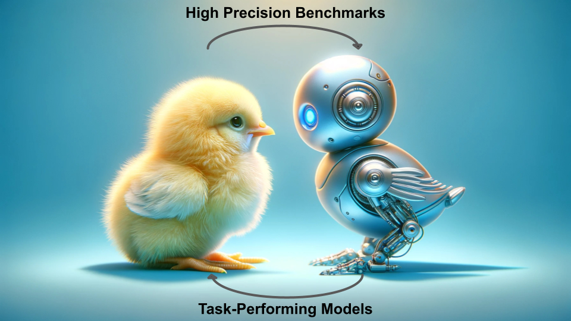
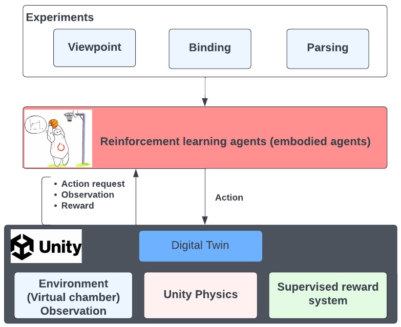

<div align="center">


# **Newborn Embodied Turing Test**

Benchmarking Virtual Agents in Controlled-Rearing Conditions


[Getting Started](#getting-started) •
[Documentation](https://buildingamind.github.io/NewbornEmbodiedTuringTest/) • 
[Lab Website](http://buildingamind.com/)

</div>

The Newborn Embodied Turing Test (NETT) is a cutting-edge toolkit designed to simulate virtual agents in controlled-rearing conditions. This innovative platform enables researchers to create, simulate, and analyze virtual agents, facilitating direct comparisons with real chicks as documented by the **[Building a Mind Lab](http://buildingamind.com/)**. Our comprehensive suite includes all necessary components for the simulation and analysis of embodied models, closely replicating laboratory conditions.

Below is a visual representation of our experimental setup, showcasing the infrastructure for the three primary experiments discussed in this documentation.

<div align="center">

</div>

## How to Use this Repository

The NETT toolkit comprises three key components:

1. **Virtual Environment**: A dynamic environment that serves as the habitat for virtual agents.
2. **Experimental Simulation Programs**: Tools to initiate and conduct experiments within the virtual world.
3. **Data Visualization Programs**: Utilities for analyzing and visualizing experiment outcomes.

## Directory Structure

The directory structure of the code is as follows:

```
├── docs                       # Documentation and guides
├── notebooks
│   ├── Getting Started.ipynb  # Introduction and setup notebook
├── src/nett
│   ├── analysis               # Analysis scripts
│   ├── body                   # Agent body configurations
│   ├── brain                  # Neural network models and learning algorithms
│   ├── environment            # Simulation environments
│   ├── utils                  # Utility functions
│   ├── nett.py                # Main library script
│   └── __init__.py            # Package initialization
├── tests                      # Unit tests
├── mkdocs.yml                 # MkDocs configuration
├── pyproject.toml             # Project metadata
└── README.md                  # This README file
```

## Getting Started

To begin benchmarking your first embodied agent with NETT, please be aware:

**Important**: The `mlagents==1.0.0` dependency is incompatible with Apple Silicon (M1, M2, etc.) chips. Please utilize an alternate device to execute this codebase.

### Installation

1. **Virtual Environment Setup** (Highly Recommended): Create and activate a virtual environment to avoid dependency conflicts.
   ```bash
   conda create -y -n nett_env python=3.10.12
   conda activate nett_env
   ```
   See [here](https://uoa-eresearch.github.io/eresearch-cookbook/recipe/2014/11/20/conda "Link for how to set-up a virtual env") for detailed instructions.

2. Install the needed versions of `setuptools` and `pip`:
   ```bash
   pip install setuptools==65.5.0 pip==21 wheel==0.38.4
   ```
   **NOTE:** This is a result of incompatibilities with the subdependency `gym==0.21`. More information about this issue can be found [here](https://github.com/openai/gym/issues/3176#issuecomment-1560026649)

3. **Toolkit Installation**: Install the toolkit using `pip`.
   ```bash
   pip install nett-benchmarks
   ```

**NOTE:**: Installation outside a virtual environment may fail due to conflicting dependencies. Ensure compatibility, especially with `gym==0.21` and `numpy<=1.21.2`.

### Running a NETT

1. **Download or Create the Unity Executable**: Obtain a pre-made Unity executable from [here](https://origins.luddy.indiana.edu/environments/). The executable is required to run the virtual environment.

2. **Import NETT Components**:
   Start by importing the NETT framework components - `Brain`, `Body`, and `Environment`, alongside the main `NETT` class.
   ```python
   from nett import Brain, Body, Environment
   from nett import NETT
   ```

3. **Component Configuration**:
- **Brain**: Configure the learning aspects, including the policy network (e.g. "CnnPolicy"), learning algorithm (e.g. "PPO"), the reward function, and the encoder.
   ```python
   brain = Brain(policy="CnnPolicy", algorithm="PPO")
   ```
   To get a list of all available policies, algorithms, and encoders, the `Brain` class contains the methods `list_policies()`, `list_algorithms()`, and `list_encoders()` respectively.
- **Body**: Set up the agent's physical interface with the environment. It's possible to apply gym.Wrappers for data preprocessing.
   ```python
   body = Body(type="basic", dvs=False, wrappers=None)
   ```
   Here, we do not pass any wrappers, letting information from the environment reach the brain "as is". Alternative body types (e.g. `two-eyed`, `rag-doll`) are planned in future updates.

- **Environment**: Create the simulation environment using the path to your Unity executable (see Step 1).
   ```python
   environment = Environment(config="identityandview", executable_path="path/to/executable.x86_64")
   ```
   To get a list of all available configurations, run `Environment.list_configs()`.

4. **Run the Benchmarking**:  Integrate all components into a NETT instance to facilitate experiment execution.
   ```python
   benchmarks = NETT(brain=brain, body=body, environment=environment)
   ```
   The `NETT` instance has a `.run()` method that initiates the benchmarking process. The method accepts parameters such as the number of brains, training/testing episodes, and the output directory.
   ```python
   job_sheet = benchmarks.run(output_dir="path/to/run/output/directory/", num_brains=5, trains_eps=10, test_eps=5)
   ```
   The `run` function is asynchronous, returning the list of jobs that may or may not be complete.
5. **Check Status**: To see the status of the benchmark processes, use the `.status()` method:
   ```python
   benchmarks.status(job_sheet)
   ```

### Running Standard Analysis

After running the experiments, the pipeline will generate a collection of datafiles in the defined output directory. 


1. **Install R and dependencies**: To run the analyses performed in previous experiments,this toolkit provides a set of analysis scripts. Prior to running them, you will need R and the packages `tidyverse`, `argparse`, and `scales` installed. To install these packages, run the following command in R:
   ```R
   install.packages(c("tidyverse", "argparse", "scales"))
   ```
   Alternatively, if you are having difficulty installing R on your system, you can install these using conda.
   ```bash
   conda install -y r r-tidyverse r-argparse r-scales
   ```
2. **Run the Analysis**: To run the analysis, use the `analyze` method of the `NETT` class. This method will generate a set of plots and tables based on the datafiles in the output directory.
   ```python
   benchmarks.analyze(run_dir="path/to/run/output/directory/", output_dir="path/to/analysis/output/directory/")
   ```

## Documentation
For a link to the full documentation, please visit [here](https://buildingamind.github.io/NewbornEmbodiedTuringTest/).

## Experiment Configuration

More information related to details on the experiment can be found on following pages.

* [**Parsing Experiment**](docs/source/papers/Parsing.md)
* [**ViewPoint Experiment**](docs/source/papers/ViewInvariant.md)

[🔼 Back to top](#newborn-embodied-turing-test)
