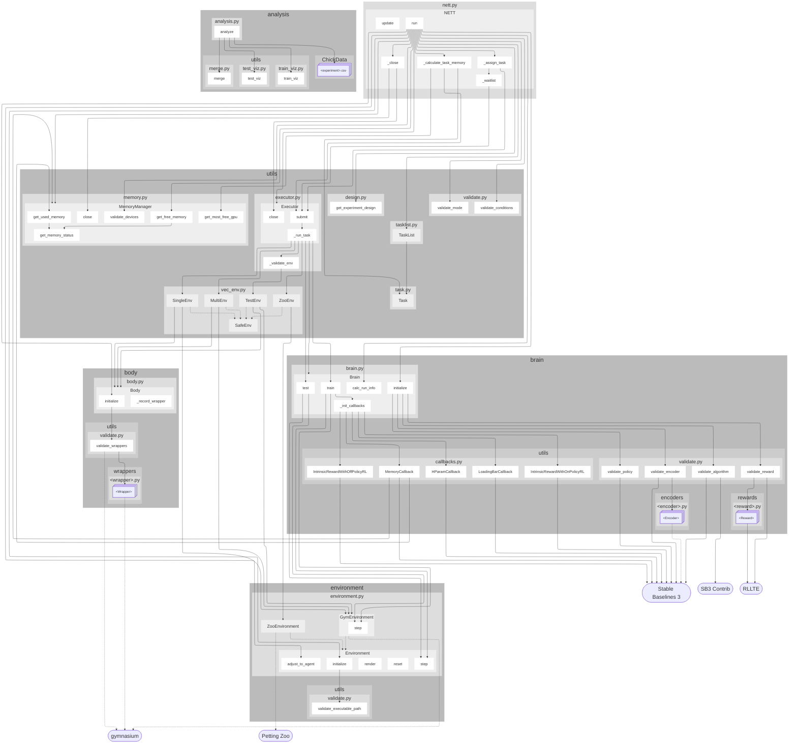

# NETT Architecture

```mermaid
%%{init: {"flowchart": {"defaultRenderer": "elk"}} }%%

flowchart TB
    classDef dir fill:#bbb,stroke-width: 0px,font-size:22pt;
    classDef subdir fill:#ccc,stroke-width: 0px,font-size:20pt;
    classDef file fill:#ddd,stroke-width: 0px,font-size:18pt;
    classDef clss fill:#eee,stroke-width: 0px,font-size:16pt;
    classDef func fill:#fff,stroke-width: 0px,font-size:14pt;
    classDef lib font-size:20pt;

    utils:::dir
    subgraph utils
        tasklist.py:::file
        subgraph tasklist.py
            TaskList:::clss
        end

        task.py:::file
        subgraph task.py
            Task:::clss
        end

        memory.py:::file
        subgraph memory.py
            MemoryManager:::clss
            subgraph MemoryManager
                MemoryManager.close[close]:::func
                get_memory_status:::func
                get_free_memory:::func
                get_used_memory:::func
                get_most_free_gpu:::func
                validate_devices:::func
            end
        end

        vec_env.py:::file
        subgraph vec_env.py
            SafeEnv:::clss
            MultiEnv:::clss
            SingleEnv:::clss
            TestEnv:::clss
            ZooEnv:::clss
        end

        executor.py:::file
        subgraph executor.py
            _validate_env:::func
            Executor:::clss
            subgraph Executor
                executor.submit[submit]:::func
                executor.close[close]:::func
                _run_task:::func
            end
        end

        validate.py:::file
        subgraph validate.py
            validate_conditions:::func
            validate_mode:::func
        end

        design.py:::file
        subgraph design.py
            get_experiment_design:::func
        end
    end

    nett.py:::file
    subgraph nett.py
        NETT:::clss
        subgraph NETT
            nett.run[run]:::func
            update:::func
            nett._close[_close]:::func
            _assign_task:::func
            _calculate_task_memory:::func
            _waitlist:::func
        end
    end
    brain:::dir
    subgraph brain
        brain.py:::file
        subgraph brain.py
            Brain:::clss
            subgraph Brain
                Brain.initialize[initialize]:::func
                calc_run_info:::func
                train:::func
                test:::func
                _init_callbacks:::func
            end
        end
        brain.utils:::subdir
        subgraph brain.utils[utils]
            brain.utils.validate:::file
            subgraph brain.utils.validate[validate.py]
                validate_algorithm:::func
                validate_encoder:::func
                validate_policy:::func
                validate_reward:::func
            end
            callbacks.py:::file
            subgraph callbacks.py
                HParamCallback:::func
                LoadingBarCallback:::func
                MemoryCallback:::func
                IntrinsicRewardWithOnPolicyRL:::func
                IntrinsicRewardWithOffPolicyRL:::func
            end
        end
        brain.encoders:::subdir
        subgraph brain.encoders[encoders]
            brain.encoders.encoder:::file
            subgraph brain.encoders.encoder[#60;encoder#62;.py]
                Encoder[#60;Encoder#62;]@{shape: processes,fill:#eee,font-size:14pt}
            end
        end
        brain.rewards:::subdir
        subgraph brain.rewards[rewards]
            brain.rewards.reward:::file
            subgraph brain.rewards.reward[#60;reward#62;.py]
                Reward[#60;Reward#62;]@{shape: processes,fill:#eee,font-size:14pt}
            end
        end
    end
    body:::dir
    subgraph body
        body.py:::file
        subgraph body.py
            Body:::clss
            subgraph Body
                Body.initialize[initialize]:::func
                _record_wrapper:::func
            end
        end
        body.utils:::subdir
        subgraph body.utils[utils]
            body.utils.validate.py:::file
            subgraph body.utils.validate.py[validate.py]
                validate_wrappers:::func
            end
        end
        wrappers:::subdir
        subgraph wrappers
            wrapper.py:::file
            subgraph wrapper.py[#60;wrapper#62;.py]
                Wrapper[#60;Wrapper#62;]@{shape: processes,fill:#eee,font-size:14pt}
            end
        end
    end
    environment:::dir
    subgraph environment
        environment.py:::file
        subgraph environment.py
            Environment:::clss
            subgraph Environment
                Environment.initialize[initialize]:::func
                adjust_to_agent:::func
                render:::func
                reset:::func
                Environment.step[step]:::func
            end
            GymEnvironment:::clss
            subgraph GymEnvironment
                GymEnvironment.step[step]:::func
            end
            ZooEnvironment:::clss
        end
        environment.utils:::subdir
        subgraph environment.utils[utils]
            environment.utils.validate.py:::file
            subgraph environment.utils.validate.py[validate.py]
                validate_executable_path:::func
            end
        end
    end

    analysis:::dir
    subgraph analysis
        analysis.py:::file
        subgraph analysis.py
            analyze:::func
        end
        ChickData:::subdir
        subgraph ChickData
            experiment[#60;experiment#62;.csv]@{shape: processes,fill:#ddd,font-size:14pt}
        end
        analysis.utils:::subdir
        subgraph analysis.utils[utils]
            merge.py:::file
            subgraph merge.py
                merge:::func
            end
            train_viz.py:::file
            subgraph train_viz.py
                train_viz:::func
            end
            test_viz.py:::file
            subgraph test_viz.py
                test_viz:::func
            end
        end
    end

    sb3@{ shape: stadium, label: "Stable Baselines 3", font-size: 40pt }
    sb3_contrib@{ shape: stadium, label: "SB3 Contrib", font-size: 40pt }
    rllte@{ shape: stadium, label: "RLLTE", font-size: 40pt }
    gym@{ shape: stadium, label: "gymnasium", font-size: 40pt }
    zoo@{ shape: stadium, label: "Petting Zoo", font-size: 40pt }

    class sb3,sb3_contrib,rllte,gym,zoo lib

    nett.run --> Brain.initialize & Body.initialize & Environment.initialize & get_experiment_design & validate_mode & calc_run_info & adjust_to_agent & MemoryManager & validate_conditions & validate_devices & TaskList & nett._close
    Brain.initialize --> validate_algorithm & validate_encoder & validate_policy & validate_reward
    Body.initialize --> validate_wrappers
    validate_wrappers --> Wrapper

    Environment.initialize --> validate_executable_path

    _calculate_task_memory --> get_most_free_gpu
    nett.run --> get_free_memory & _calculate_task_memory & _assign_task & Executor
    _validate_env --> TestEnv
    _run_task --> Brain & ZooEnv & SingleEnv & MultiEnv & train & test & _validate_env
    ZooEnv --> ZooEnvironment
    SingleEnv & MultiEnv & TestEnv --> GymEnvironment & Body

    TaskList & _calculate_task_memory --> Task

    _assign_task --> _waitlist
    _assign_task & _waitlist & _calculate_task_memory --> executor.submit

    nett._close --> MemoryManager.close & executor.close
    executor.submit --> _run_task

    get_free_memory & get_used_memory--> get_memory_status

    train & test --> GymEnvironment.step & Environment.step
    GymEnvironment & ZooEnvironment -.-> Environment
    ZooEnvironment -.-> zoo

    MultiEnv & SingleEnv & TestEnv & ZooEnv-.-> SafeEnv

    train --> _init_callbacks

    validate_algorithm & validate_encoder & validate_policy --> sb3
    Encoder -.-> sb3
    validate_algorithm --> sb3_contrib
    validate_reward & Reward --> rllte

    validate_encoder --> Encoder
    validate_reward --> Reward

    Wrapper & GymEnvironment & validate_wrappers -.-> gym

    analyze --> experiment & merge & train_viz & test_viz

    _init_callbacks --> MemoryCallback & HParamCallback & LoadingBarCallback & IntrinsicRewardWithOnPolicyRL & IntrinsicRewardWithOffPolicyRL --> sb3
    MemoryCallback --> MemoryManager
    MemoryCallback --> get_used_memory
```
