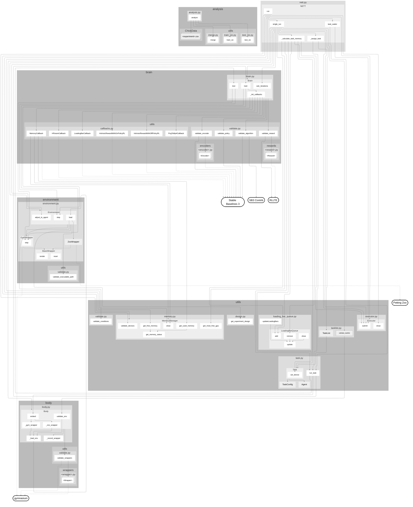

# NETT Architecture

```mermaid
---
config:
  theme: neutral
  look: classic
  layout: elk
---


flowchart TB
    classDef dir fill:#bbb,stroke-width:0px,font-size:22pt;
    classDef subdir fill:#ccc,stroke-width:0px,font-size:20pt;
    classDef file fill:#ddd,stroke-width:0px,font-size:18pt;
    classDef clss fill:#eee,stroke-width:0px,font-size:16pt;
    classDef func fill:#fff,stroke-width:0px,font-size:14pt;
    classDef stack fill:#fff,stroke:#ccc,font-size:14pt;
    classDef lib fill:#fff,stroke:#000,stroke-width:3px,font-size:20pt;

    utils:::dir
    subgraph utils
        tasklist.py:::file
        subgraph tasklist.py
            TaskList:::clss
            validate_tasklist
        end

        task.py:::file
        subgraph task.py
            Task:::clss
            subgraph Task
                set_device:::func
            end
            run_task:::func
            TaskConfig:::clss
            Agent:::clss
        end

        memory.py:::file
        subgraph memory.py
            MemoryManager:::clss
            subgraph MemoryManager
                MemoryManager.close[close]:::func
                get_memory_status:::func
                get_free_memory:::func
                get_used_memory:::func
                get_most_free_gpu:::func
                validate_devices:::func
            end
        end

        executor.py:::file
        subgraph executor.py
            Executor:::clss
            subgraph Executor
                executor.submit[submit]:::func
                executor.close[close]:::func
            end
        end

        validate.py:::file
        subgraph validate.py
            validate_conditions:::func
        end

        design.py:::file
        subgraph design.py
            get_experiment_design:::func
        end

        loading_bar_queue.py:::file
        subgraph loading_bar_queue.py
            LoadingBarQueue:::clss
            subgraph LoadingBarQueue
                LoadingBarQueue.add[add]:::func
                LoadingBarQueue.update[update]:::func
                LoadingBarQueue.remove[remove]:::func
                LoadingBarQueue.close[close]:::func
            end
            updateLoadingBars:::func
        end
    end

    nett.py:::file
    subgraph nett.py
        NETT:::clss
        subgraph NETT
            nett.run[run]:::func
            single_run:::func
            _assign_task:::func
            _calculate_task_memory:::func
            task_waiter:::func
        end
    end
    brain:::dir
    subgraph brain
        brain.py:::file
        subgraph brain.py
            Brain:::clss
            subgraph Brain
                calc_iterations:::func
                train:::func
                test:::func
                _init_callbacks:::func
            end
        end
        brain.utils:::subdir
        subgraph brain.utils[utils]
            brain.utils.validate:::file
            subgraph brain.utils.validate[validate.py]
                validate_algorithm:::func
                validate_encoder:::func
                validate_policy:::func
                validate_reward:::func
            end
            callbacks.py:::file
            subgraph callbacks.py
                HParamCallback:::func
                LoadingBarCallback:::func
                MemoryCallback:::func
                IntrinsicRewardWithOnPolicyRL:::func
                IntrinsicRewardWithOffPolicyRL:::func
                PngToMp4Callback:::func
            end
        end
        brain.encoders:::subdir
        subgraph brain.encoders[encoders]
            brain.encoders.encoder:::file
            subgraph brain.encoders.encoder[#60;encoder#62;.py]
                Encoder[#60;Encoder#62;]@{shape: processes}
            end
        end
        brain.rewards:::subdir
        subgraph brain.rewards[rewards]
            brain.rewards.reward:::file
            subgraph brain.rewards.reward[#60;reward#62;.py]
                Reward[#60;Reward#62;]@{shape: processes}
            end
        end
    end
    body:::dir
    subgraph body
        body.py:::file
        subgraph body.py
            Body:::clss
            subgraph Body
                embed:::func
                validate_env:::func
                _zoo_wrapper:::func
                _gym_wrapper:::func
            end
            _record_wrapper:::func
            _load_env:::func
        end
        body.utils:::subdir
        subgraph body.utils[utils]
            body.utils.validate.py:::file
            subgraph body.utils.validate.py[validate.py]
                validate_wrappers:::func
            end
        end
        wrappers:::subdir
        subgraph wrappers
            wrapper.py:::file
            subgraph wrapper.py[#60;wrapper#62;.py]
                Wrapper[#60;Wrapper#62;]@{shape: processes}
            end
        end
    end
    environment:::dir
    subgraph environment
        environment.py:::file
        subgraph environment.py
            Environment:::clss
            subgraph Environment
                Environment.load[load]:::func
                adjust_to_agent:::func
                Environment.step[step]:::func
            end
            BaseWrapper:::clss
            subgraph BaseWrapper
                BaseWrapper.render[render]:::func
                BaseWrapper.reset[reset]:::func
            end
            ZooWrapper:::clss
            GymWrapper:::clss
            subgraph GymWrapper
                GymWrapper.step[step]:::func
            end
        end
        environment.utils:::subdir
        subgraph environment.utils[utils]
            environment.utils.validate.py:::file
            subgraph environment.utils.validate.py[validate.py]
                validate_executable_path:::func
            end
        end
    end

    analysis:::dir
    subgraph analysis
        analysis.py:::file
        subgraph analysis.py
            analyze:::func
        end
        ChickData:::subdir
        subgraph ChickData
            experiment[#60;experiment#62;.csv]@{shape: processes}
        end
        analysis.utils:::subdir
        subgraph analysis.utils[utils]
            merge.py:::file
            subgraph merge.py
                merge:::func
            end
            train_viz.py:::file
            subgraph train_viz.py
                train_viz:::func
            end
            test_viz.py:::file
            subgraph test_viz.py
                test_viz:::func
            end
        end
    end


    sb3@{ shape: stadium, label: "Stable Baselines 3", font-size: 40pt }
    sb3_contrib@{ shape: stadium, label: "SB3 Contrib", font-size: 40pt }
    rllte@{ shape: stadium, label: "RLLTE", font-size: 40pt, img: "" }
    gym@{ shape: stadium, label: "gymnasium", font-size: 40pt }
    zoo@{ shape: stadium, label: "Petting Zoo", font-size: 40pt }

    class sb3,sb3_contrib,rllte,gym,zoo lib
    class Encoder,Wrapper,Reward stack
    style experiment fill:#eee,stroke:#bbb,font-size:16pt

    nett.run --> MemoryManager & MemoryManager.close & validate_devices & single_run & get_free_memory & task_waiter & Executor & executor.close
    single_run --> Brain & Body & Environment & calc_iterations & adjust_to_agent & _calculate_task_memory & TaskList & LoadingBarQueue.add & executor.submit & validate_tasklist & _assign_task

    Brain --> validate_algorithm & validate_encoder & validate_policy & validate_reward
    Body --> validate_wrappers
    validate_wrappers --> Wrapper

    embed --> _gym_wrapper & _zoo_wrapper
    validate_tasklist --> validate_env

    Environment --> validate_conditions & validate_executable_path & get_experiment_design

    _calculate_task_memory --> get_most_free_gpu & Task & set_device & LoadingBarQueue.add & LoadingBarQueue.remove
    validate_env & _zoo_wrapper & _gym_wrapper --> _load_env
    run_task --> embed & train & test
    Environment.load --> GymWrapper & ZooWrapper

    TaskList --> Task

    LoadingBarQueue.remove & LoadingBarQueue.close & updateLoadingBars --> LoadingBarQueue.update

    _calculate_task_memory & task_waiter & _assign_task --> executor.submit & run_task

    get_free_memory & get_used_memory--> get_memory_status

    train & test --> GymWrapper.step & Environment.step
    GymWrapper & ZooWrapper -.-> BaseWrapper
    ZooWrapper -.-> zoo

    train --> _init_callbacks

    validate_algorithm & validate_encoder & validate_policy --> sb3
    Encoder -.-> sb3
    validate_algorithm --> sb3_contrib
    validate_reward --> rllte
    Reward -.-> rllte

    validate_encoder --> Encoder
    validate_reward --> Reward

    Wrapper & GymWrapper & validate_wrappers -.-> gym

    analyze --> experiment & merge & train_viz & test_viz

    _init_callbacks --> MemoryCallback & HParamCallback & LoadingBarCallback & IntrinsicRewardWithOnPolicyRL & IntrinsicRewardWithOffPolicyRL & PngToMp4Callback -.-> sb3
    MemoryCallback --> MemoryManager & MemoryManager.close
    MemoryCallback --> get_used_memory

    Body--> _record_wrapper

    _load_env --> Environment.load

    Task --> TaskConfig & Agent

```
