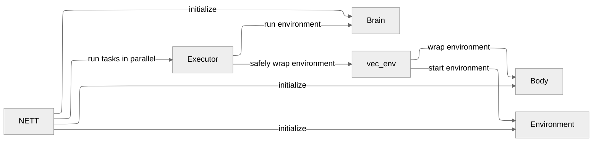

# NETT Simplified Architecture

```mermaid
---
config:
  theme: neutral
  look: classic
  layout: elk
---


flowchart LR

NETT -- initialize --> Brain & Body & Environment
NETT -- run tasks in parallel --> Executor
Executor -- safely wrap environment --> vec_env
vec_env -- start environment -->  Environment
vec_env -- wrap environment -->  Body
Executor -- run environment --> Brain

```
