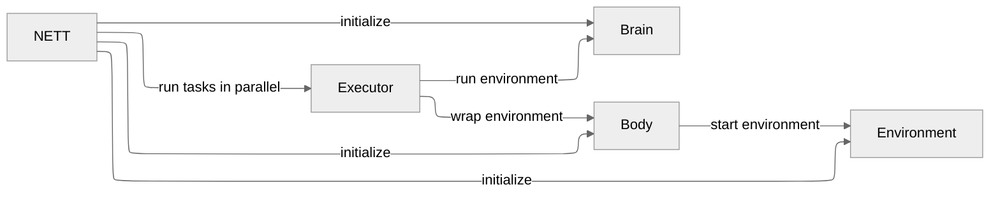

# NETT Simplified Architecture

```mermaid
---
config:
  theme: neutral
  look: classic
  layout: elk
---

flowchart LR

NETT -- initialize --> Brain & Body & Environment 
NETT -- run tasks in parallel --> Executor
Executor -- wrap environment -->  Body
Body -- start environment --> Environment
Executor -- run environment --> Brain
```
